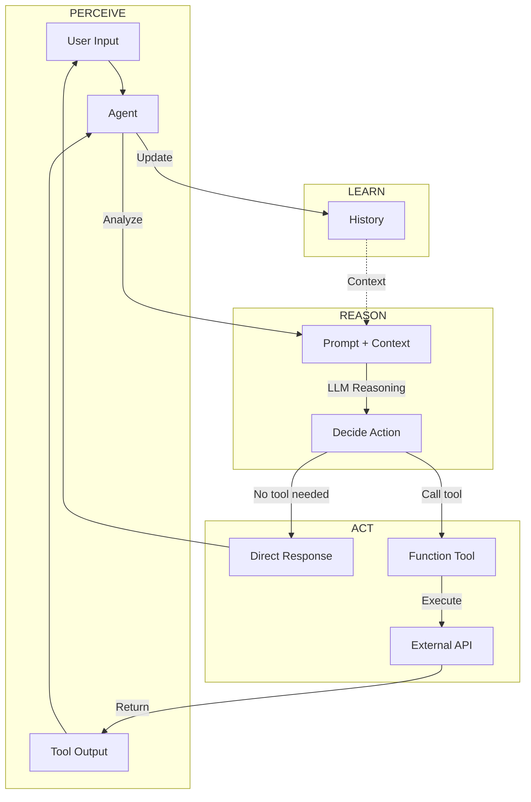
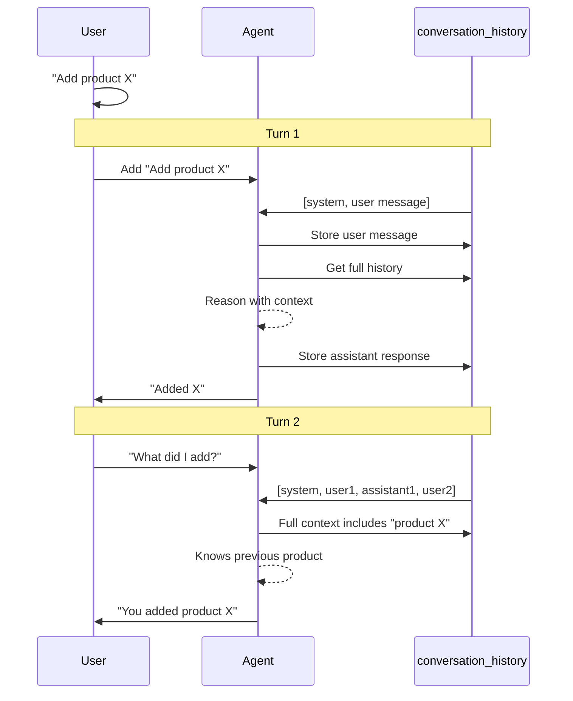
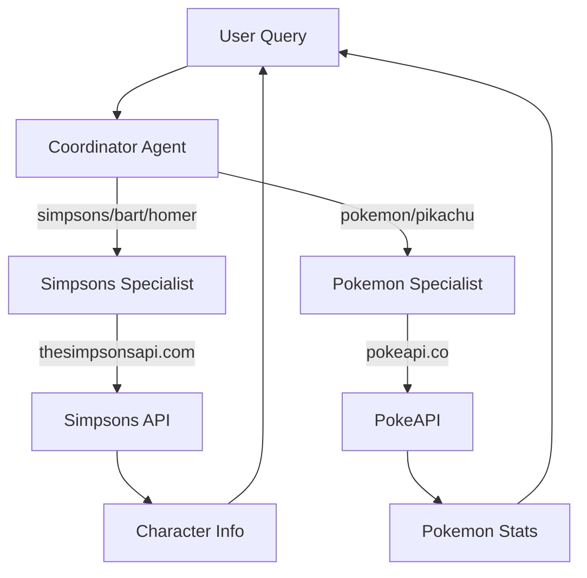
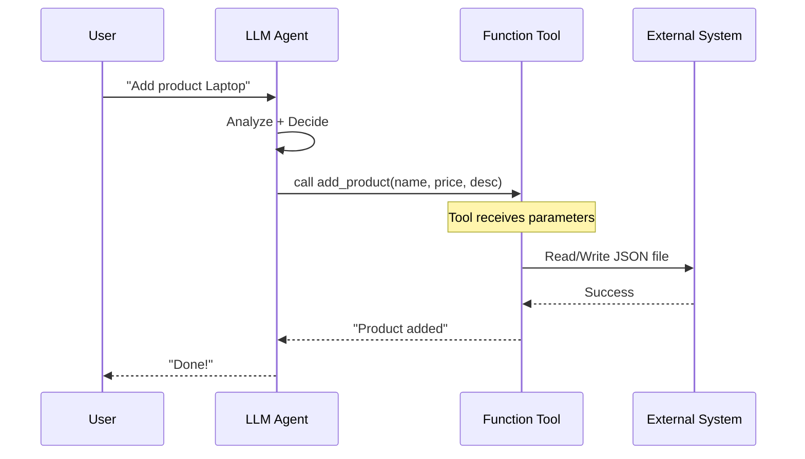
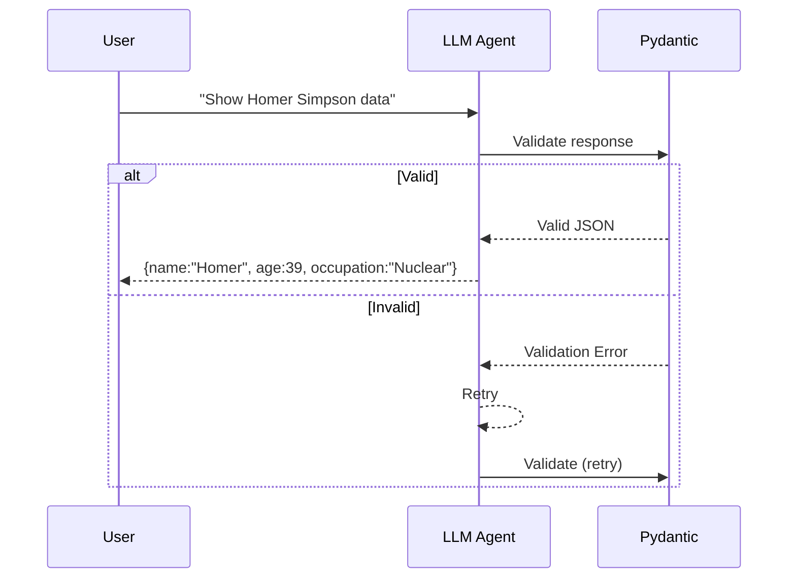
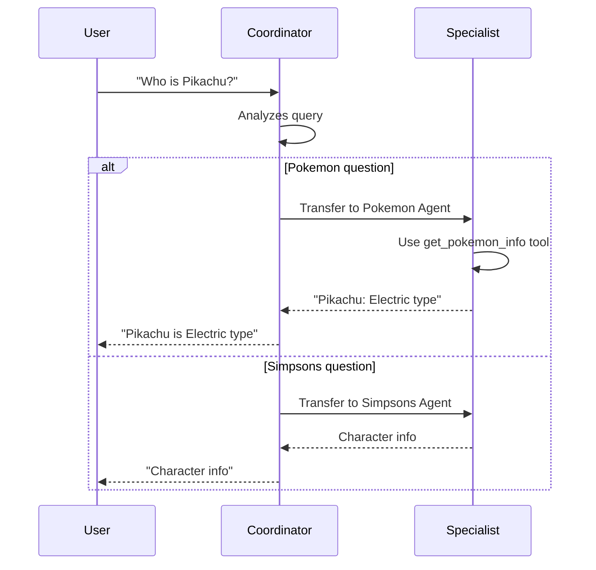

# 🤖 IA Agents - Practical Examples


This repository contains practical examples of IA Agents, presented in the **BugMentor Conf Argentina 2026** talk: [IA Agents - From Concepts to Production](https://youtu.be/W-b31CWTLJ0).

## 📺 About the Talk

**IA Agents** explores how Artificial Intelligence is redefining software development. From basic concepts to practical applications, this talk demonstrates how IA agents drive efficiency and reliability.

### Presented by

- **Matías J. Magni** | CEO @ [BugMentor](https://bugmentor.com)
- **Mauro Radino** | AI Dev Developer

---

## 🧠 What Are IA Agents?

IA Agents are autonomous AI systems that can:

- **Perceive** environments through tools
- **Reason** about actions to take
- **Act** by executing tools or functions
- **Learn** from interactions

Unlike simple LLMs, agents can actively interact with external systems and maintain conversation context.



---

## 📁 Repository Structure

```
ai-agents-example/
├── agent_example.py     # Simple agent with 1 tool
├── agent_memory.py   # Agent with conversation history
├── agent_multi.py   # Multi-agent system (Coordinator + Specialists)
├── data.json       # Product database
├── README.md      # This file
├── LICENSE       # MIT License
├── .gitignore   # Git ignore
├── tests/             # Test suite
│   ├── __init__.py
│   ├── test_agent_example.py   # Tests for simple agent
│   ├── test_agent_memory.py   # Tests for memory agent
│   └── test_agent_multi.py    # Tests for multi-agent
├── scripts_unix/         # Scripts for macOS/Linux
│   ├── run_agent_*.sh
│   └── test_*.sh
├── scripts_windows/    # Scripts for Windows
│   ├── run_agent_*.bat
│   └── test_*.bat
└── .env             # Environment variables (optional)
```

---

## 🚀 Quick Start

### Prerequisites

1. **Python 3.9+**
2. **Ollama** installed locally

### Install Ollama (Mac/Linux/Windows)

```bash
# macOS
brew install ollama

# Linux
curl -fsSL https://ollama.ai/install.sh | sh

# Windows (WSL)
curl -fsSL https://ollama.ai/install.sh | sh
```

Then start Ollama:
```bash
ollama serve
```

### Download Mistral Model

```bash
# Download Mistral model (recommended for these examples)
ollama pull mistral

# Or use a larger model
ollama pull llama3.2

# Or use a model optimized for function calling
ollama pull qwen3:8b
```

### Install Python Dependencies

```bash
# Install dependencies
pip install openai-agents httpx python-dotenv requests pydantic
```

### Run Examples

```bash
# Example 1: Simple Agent
python agent_example.py

# Example 2: Agent with Memory
python agent_memory.py

# Example 3: Multi-Agent System
python agent_multi.py
```

---

## 📖 Examples Explained

### 1. Simple Agent (`agent_example.py`)

The most basic agent pattern: single LLM + one tool function.

```python
@function_tool
def add_product(name: str, price: str, description: str) -> str:
    """Add a product to the JSON database"""
    # ... tool logic
    return "Product added successfully."

agent = Agent(
    name="Assistant",
    instructions="You help add products to a JSON database.",
    tools=[add_product]
)
```

**Key Concepts:**
- `@function_tool` decorator for tool definition
- Tool receives: `name`, `price`, `description`
- Tool acts: writes to `data.json`
- Agent reasoning: decides WHEN to call the tool

**Run:**
```bash
echo "Add product named Laptop, price 999, description Powerful computer" | python agent_example.py
```

---

### 2. Agent with Memory (`agent_memory.py`)

Adding conversation history enables the agent to "remember" previous exchanges.



```python
# Global conversation history for this session
conversation_history = [
    {"role": "system", "content": SYSTEM_PROMPT}
]

# ... in the loop:
conversation_history.append({"role": "user", "content": user_input})
result = await model.generate(messages=conversation_history)
conversation_history.append({"role": "assistant", "content": result})
```

**Key Concepts:**
- `conversation_history` list stores messages with roles
- Full history sent to model each turn
- Model sees previous context
- Enables: "What did I add last time?"

**Run:**
```bash
echo "What did I add last?" | python agent_memory.py
```

---

### 3. Multi-Agent System (`agent_multi.py`)

Coordinator delegates to specialized agents:



**Specialists:**
- **Simpsons**: Uses `thesimpsonsapi.com` for character info
- **Pokemon**: Uses `pokeapi.co` for Pokemon stats

**Coordinator Logic:**
```python
def coordinator(user_input):
    user_lower = user_input.lower()
    
    if any(word in user_lower for word in ["simpsons", "homero", "bart"]):
        return run_simpsons(user_input)
    elif any(word in user_lower for word in ["pokemon", "pikachu"]):
        return run_pokemon(user_input)
    else:
        return "I can help with Simpsons or Pokemon."
```

**Run:**
```bash
# Test Pokemon
echo "What is Pikachu?" | python agent_multi.py

# Test Simpsons  
echo "Tell me about Bart Simpson" | python agent_multi.py
```

---

## 🛠️ Tech Stack

| Technology | Purpose |
|-------------|---------|
| **Python 3.9+** | Programming language |
| **Ollama** | Local LLM (Mistral, Llama3, etc.) |
| **httpx** | Async HTTP client |
| **pydantic** | Structured output validation |
| **requests** | Sync HTTP for tools |

### Using with OpenAI (optional)

Create `.env`:
```bash
OPENAI_API_KEY=sk-your-key-here
```

The code can use OpenAI by changing:
```python
# For OpenAI Agents SDK:
agent = Agent(
    name="Assistant",
    instructions=...,
    model="gpt-4o",
    tools=[...]
)
```

---

## 🔧 Adapting to Other LLMs

### Ollama Models

```python
class OllamaModel:
    def __init__(self, model_name="mistral"):
        self.model_name = model_name
        self.base_url = "http://localhost:11434"

    async def generate(self, messages, tools=None):
        # ... calls http://localhost:11434/api/chat
```

**Available Ollama models:**
- `mistral` - Fast, good reasoning
- `llama3.2` - Larger, more capable
- `qwen3:8b` - Excellent for function calling

### Tool Calling Differences

Different models handle tool calling differently:

| Model | Tool Calling |
|-------|--------------|
| **GPT-4o** | Native `tool_calls` field |
| **Claude** | Native tool_use field |
| **Ollama Mistral** | Returns JSON in `content` |

**Workaround for Ollama:**
```python
# Parse content as JSON if tool_calls is empty
if not tool_calls and content.strip().startswith("["):
    parsed = json.loads(content)
    if parsed and "name" in parsed[0]:
        tool_calls = [{"function": parsed[0]}]
```

---

### Pattern 1: Function Tool



```python
@function_tool
def my_tool(param: str) -> str:
    """Description for the agent"""
    return result
```

### Pattern 2: Output Type (Structured Response)



```python
from pydantic import BaseModel

class CharacterOutput(BaseModel):
    name: str
    age: int
    occupation: str

agent = Agent(
    output_type=CharacterOutput,
    # ...
)
```

### Pattern 3: Handoffs



```python
specialist_agent = Agent(
    name="Specialist",
    handoff_description="Handles X topic"
)

coordinator = Agent(
    name="Coordinator",
    handoffs=[specialist_agent]
)
```

---

## 📋 Data Files

### `data.json`

```json
[
  {
    "name": "Laptop",
    "price": "999",
    "description": "Powerful computer"
  },
  {
    "name": "Phone", 
    "price": "599",
    "description": "Smart device"
  }
]
```

---

## 🧪 Test Suite

This project uses a comprehensive L0-L3 testing pyramid:

### Test Levels

| Level | Name | Description | Tests |
|-------|------|-------------|-------|
| L0 | Unit | Individual components | 9 |
| L1 | Integration | Tools work correctly | 5 |
| L2 | Service | API calls work | 4 |
| L3 | End-to-End | Full agent flows | 7 |

**Total: 25 tests**

### Run Tests

```bash
# All tests
./scripts_unix/test_all.sh
python -m pytest tests/ -v

# By level
./scripts_unix/test_l0.sh   # Unit tests
./scripts_unix/test_l1.sh   # Integration tests
./scripts_unix/test_l2.sh   # Service tests
./scripts_unix/test_l3.sh   # E2E tests

# By agent
./scripts_unix/test_agent_example.sh  # Simple agent
./scripts_unix/test_agent_memory.sh  # Memory agent
./scripts_unix/test_agent_multi.sh   # Multi-agent

# Windows
scripts_windows\test_all.bat
scripts_windows\test_l0.bat
scripts_windows\test_agent_example.bat
```

### Test Structure

```
tests/
├── __init__.py
├── test_agent_example.py   # 8 tests for simple agent
├── test_agent_memory.py  # 7 tests for memory agent
└── test_agent_multi.py  # 10 tests for multi-agent
```

---

## 🐛 Troubleshooting

### "Module not found: agents"

```bash
pip install openai-agents
```

### "Connection refused" (Ollama)

```bash
# Start Ollama
ollama serve
# Or in another terminal:
ollama run mistral
```

### "401 Unauthorized"

Your API key needs to be set. Create `.env`:
```bash
OPENAI_API_KEY=sk-your-key
```

### JSON Parsing Issues

Mistral returns tool calls as JSON in `content`:
```python
if not tool_calls and content.strip().startswith("["):
    tool_calls = [{"function": json.loads(content)[0]}]
```

---

## 🎯 Learning Objectives

After this workshop, you will understand:

- [x] What IA Agents are and how they differ from LLMs
- [x] How to define tools with `@function_tool`
- [x] Implementing conversation memory
- [x] Multi-agent orchestration patterns
- [x] Working with real APIs (PokeAPI, Simpsons API)
- [x] Adapting to different LLM providers

---

## 📞 Support

- **Issues**: Open a GitHub issue
- **Discussion**: Start a discussion thread

---

## 📄 License

MIT License - See [LICENSE](LICENSE) for details.

---

## 🙏 Acknowledgments

- **Matías J. Magni** - CEO @ [BugMentor](https://bugmentor.com)
- **Mauro Radino** - AI Dev Developer
- **BugMentor Community**
- **Ollama Team** for local AI

---

## 🔗 Resources

- [Talk Video: IA Agents - BugMentor Conf Argentina 2026](https://youtu.be/W-b31CWTLJ0)
- [Ollama Documentation](https://ollama.ai)
- [OpenAI Agents SDK](https://docs.openai.com/docs/agents)
- [PokeAPI](https://pokeapi.co)
- [The Simpsons API](https://thesimpsonsapi.com)

---

*Built with ❤️ for the AI Engineering Community*